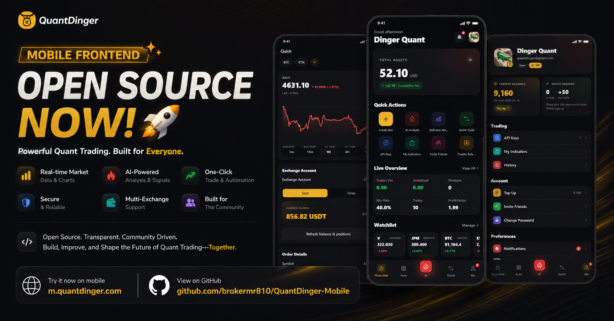

# QuantDinger 手机端

<p align="right"><a href="README.md">English</a></p>

<p align="center">
  <a href="banner.png" title="查看完整海报"></a>
</p>

**QuantDinger Mobile** 是 [QuantDinger](https://github.com/OpenByteInc/QuantDinger) 的手机端和 H5 客户端。QuantDinger 是 **Open Byte Inc** 推出的开源 **AI Trading OS**，面向自动化交易、AI 分析、策略工作流和账户运营。

手机端主要服务于随身查看和轻量操作：查看行情与 AI 分析、管理策略和交易机器人、进行闪电交易、调整账户设置、维护交易所 API 等。它不是另一套独立系统，而是同一套后端之上的移动界面。

同一套 Vue 3 代码可以发布为：

- Docker 或静态站点托管的 H5 应用
- 通过 Capacitor 打包的 Android 应用
- 在 macOS + Xcode 环境下打包的 iOS 应用

## 推荐部署方式

大多数用户建议直接跟随主仓库部署整套 QuantDinger。主仓库 Compose 会自动拉取手机端镜像，并把 `/api/` 转发到后端，不需要手动配置前后端连接。

Linux 或 macOS：

```bash
curl -fsSL https://raw.githubusercontent.com/OpenByteInc/QuantDinger/main/install.sh | bash
```

Windows PowerShell：

```powershell
irm https://raw.githubusercontent.com/OpenByteInc/QuantDinger/main/install.ps1 | iex
```

完整部署后的默认地址：

| 客户端 | 地址 |
|--------|------|
| 桌面端 Web | `http://localhost:8888` |
| 手机端 H5 | `http://localhost:8889` |
| 后端 API | 由前端容器通过 `/api/` 自动反向代理 |

如果用手机访问同一局域网内的电脑，请把 `localhost` 换成电脑的局域网 IP，例如：

```text
http://192.168.1.10:8889
```

## GHCR 镜像

手机端镜像地址：

```text
ghcr.io/openbyteinc/quantdinger-mobile
```

常用标签包括 `latest`、具体语义化版本，以及 `4.0` 这样的主次版本标签。在主仓库 `.env` 中可以用 `IMAGE_TAG` 固定整套系统版本，也可以用 `MOBILE_TAG` 单独固定手机端版本。

如果后端已经部署好，也可以单独运行手机端镜像：

```bash
docker run -d --name quantdinger-mobile \
  -p 8889:80 \
  -e BACKEND_URL=http://host.docker.internal:5000 \
  ghcr.io/openbyteinc/quantdinger-mobile:latest
```

`BACKEND_URL` 控制容器内 Nginx 的 `/api/` 反向代理目标。主仓库 Compose 里通常保持为 `http://backend:5000`。

## 本地开发

### 环境要求

| 工具 | 版本 |
|------|------|
| Node.js | Node 20.19+ 或 22.12+。推荐直接使用 Node 22 LTS。 |
| npm | 随 Node 安装即可。 |
| 后端 | 默认要求 QuantDinger API 可通过 `http://localhost:5000` 访问。 |
| 原生构建 | Android 需要 Android Studio；iOS 需要 macOS 和 Xcode。 |

### 启动 H5 开发服务

```bash
git clone https://github.com/OpenByteInc/QuantDinger-Mobile.git
cd QuantDinger-Mobile
npm install
npm run dev
```

浏览器打开：

```text
http://localhost:5173
```

Vite 会把 `/api/*` 默认转发到：

```text
http://localhost:5000
```

如果后端不在这个地址，启动前设置：

```bash
VITE_DEV_API_TARGET=http://127.0.0.1:5000 npm run dev
```

开发者工具里看到 `http://localhost:5173/api/...` 是正常现象：浏览器先请求 Vite，Vite 再把请求转发到真正的后端。

## API 地址应该怎么配

手机端和 H5 优先推荐使用同源 `/api/` 反向代理。这样最少遇到跨域问题，也和 Docker 部署方式一致。

| 运行方式 | 推荐做法 |
|----------|----------|
| 主仓库 Docker 部署 | 通常不用改。手机端在 `MOBILE_PORT` 提供 H5，`/api/` 自动转发到后端。 |
| 单独运行手机端 Docker 镜像 | 如果后端不是同网络里的 `http://backend:5000`，启动容器时传入 `BACKEND_URL`。 |
| `npm run dev` 本地开发 | 如果后端不在 `http://localhost:5000`，设置 `VITE_DEV_API_TARGET`。 |
| 自己部署静态 H5 | 发布 `dist/`，并在 Web 服务器上把 `/api/` 反代到 QuantDinger 后端。 |
| Android / iOS 原生壳 | 填手机能访问到的后端地址，例如公网 `https://api.example.com`，或测试时的局域网 IP。 |
| 想给新安装用户预设默认地址 | 构建时设置 `VITE_DEFAULT_SERVER_URL=https://api.example.com`，用户仍可在应用内覆盖。 |

APK / IPA 里的默认后端地址是在打包时写进去的。用户安装后仍然可以在 **个人中心 → 服务器设置** 里手动修改，但如果你要把安装包发给别人，建议打包前先把默认地址改成你自己的服务器。

创建或修改 `.env.production`：

```env
VITE_DEFAULT_SERVER_URL=https://api.example.com
VITE_PUBLIC_WEB_BASE_URL=https://m.example.com
```

注意：

- `VITE_DEFAULT_SERVER_URL` 必须是手机能访问到的地址，不能只在你的电脑上能访问。
- 公网部署建议使用 HTTPS。部分 Android 设备或网络环境会限制不安全的 HTTP 请求。
- APK 里不要填 `localhost` 或 `127.0.0.1`，手机上的 `localhost` 指的是手机自己，不是你的电脑或服务器。
- 局域网测试可以填电脑的局域网 IP，例如 `http://192.168.1.10:5000`。
- 地址末尾有没有 `/` 都可以，应用会自动去掉末尾斜杠。

## 构建

### H5 构建

```bash
npm run build
npm run preview
```

生产产物会输出到 `dist/`。

如果自行托管静态 H5，请确认：

- SPA 路由回退到 `index.html`
- `/api/` 已反向代理到 QuantDinger 后端
- 公网环境启用了 HTTPS
- 如果启用 OAuth，后端允许当前 H5 域名作为回跳地址

### Android

如果你要打包给自己的服务器使用，先在 `.env.production` 里写好默认后端地址：

```env
VITE_DEFAULT_SERVER_URL=https://api.example.com
VITE_PUBLIC_WEB_BASE_URL=https://m.example.com
```

然后再打包：

```bash
npm install
npm run cap:assets
npm run build:android
cd android
./gradlew assembleDebug
```

Windows PowerShell 示例：

```powershell
$env:JAVA_HOME = "C:\Program Files\Android\Android Studio\jbr"
$env:Path = "$env:JAVA_HOME\bin;$env:Path"
npm.cmd run cap:assets
npm.cmd run build:android
cd android
.\gradlew.bat assembleDebug
```

也可以在 PowerShell 里临时指定一次，不改 `.env.production`：

```powershell
$env:VITE_DEFAULT_SERVER_URL = "https://api.example.com"
$env:VITE_PUBLIC_WEB_BASE_URL = "https://m.example.com"
npm.cmd run build
npx.cmd cap sync android
cd android
.\gradlew.bat assembleDebug
```

Debug APK 输出位置：

```text
android/app/build/outputs/apk/debug/app-debug.apk
```

发布版签名文件不会提交到仓库。请把 keystore 和签名配置保存在本机安全位置或 CI secrets 中。

### iOS

iOS 构建需要 macOS 和 Xcode：

```bash
npm run cap:assets
npm run build:ios
npm run cap:ios
```

## 目录结构

```text
QuantDinger-Mobile/
├── src/
│   ├── api/                # 请求封装和接口模块
│   ├── assets/             # 图片和静态资源
│   ├── components/         # 手机端通用组件
│   ├── config/             # 默认服务地址、H5 地址、主题等
│   ├── router/             # Vue Router 4
│   ├── stores/             # Pinia 状态
│   ├── styles/             # 全局样式
│   ├── utils/              # 工具函数
│   └── views/              # 页面模块
├── android/                # Capacitor Android 工程
├── ios/                    # Capacitor iOS 工程
├── deploy/                 # Docker 镜像使用的 Nginx 模板
├── capacitor.config.json
├── vite.config.js
├── package.json
└── LICENSE
```

## 技术栈

| 层级 | 技术 |
|------|------|
| 框架 | Vue 3 |
| 构建 | Vite 7 |
| 原生壳 | Capacitor 6 |
| 移动端 UI | Vant 4 |
| 状态管理 | Pinia |
| 路由 | Vue Router 4 |
| 多语言 | vue-i18n |
| 请求 | Axios |

## 常见问题

| 现象 | 排查方向 |
|------|----------|
| Vite 提示需要 Node 20.19+ 或 22.12+ | 切换到 Node 22 LTS。 |
| H5 刷新页面后 404 | Web 服务器没有配置 SPA 回退到 `index.html`。 |
| H5 接口跨域或请求失败 | 优先使用同源 `/api/` 反向代理；或者在后端显式放行当前 H5 域名。 |
| 手机访问不到本地后端 | 用电脑的局域网 IP，不要用 `localhost`。手机上的 `localhost` 指手机自己。 |
| Docker 容器启动了但接口不通 | 检查 `BACKEND_URL`，以及容器内部是否能访问这个地址。 |
| OAuth 回跳地址不对 | 更新后端 `FRONTEND_URL` 和 `OAUTH_ALLOWED_REDIRECTS`，然后重启或重新部署后端。 |

## 相关仓库

| 仓库 | 作用 |
|------|------|
| [QuantDinger](https://github.com/OpenByteInc/QuantDinger) | 后端 API、Docker Compose、数据库服务和部署文档 |
| [QuantDinger-Vue](https://github.com/OpenByteInc/QuantDinger-Vue) | 桌面端 Web 前端 |
| **QuantDinger-Mobile** | 本仓库：手机端和 H5 前端 |

## 许可协议

本仓库使用 **QuantDinger Frontend Source-Available License v1.0**，完整条款见 [`LICENSE`](./LICENSE)。

简单说：符合条款的非商业用途和合格非营利用途可以免费使用；商业用途需要取得 **Open Byte Inc** 的书面授权。请保留版权声明、许可文件和应用内要求保留的 QuantDinger 品牌署名。

## 联系方式

- 官网：[quantdinger.com](https://quantdinger.com)
- Telegram：[t.me/worldinbroker](https://t.me/worldinbroker)
- 邮箱：[support@quantdinger.com](mailto:support@quantdinger.com)
